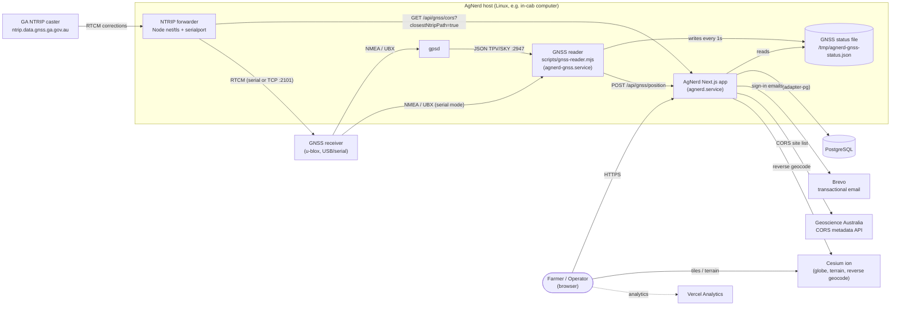
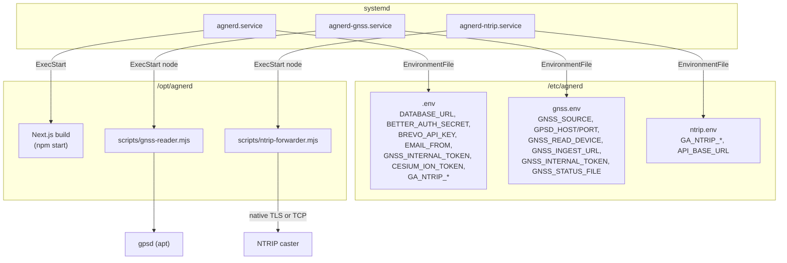
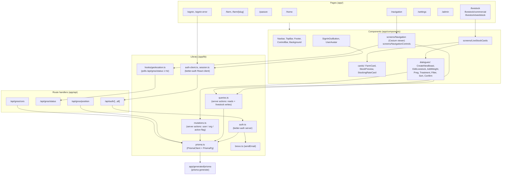
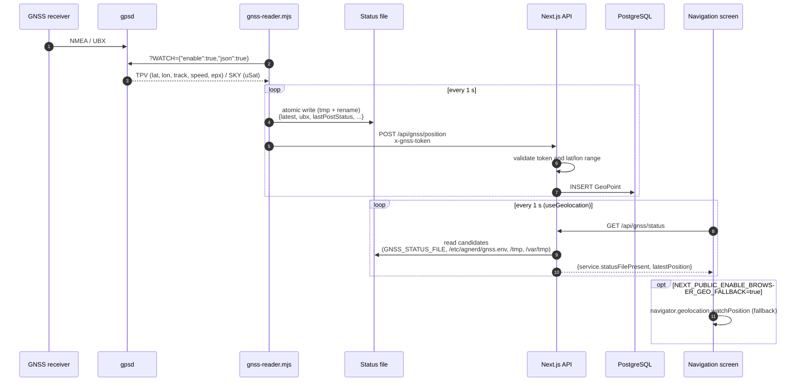
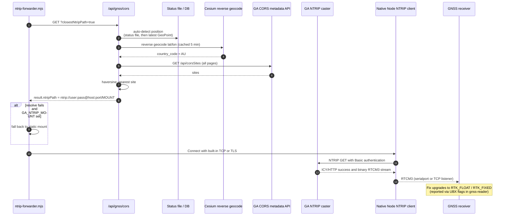
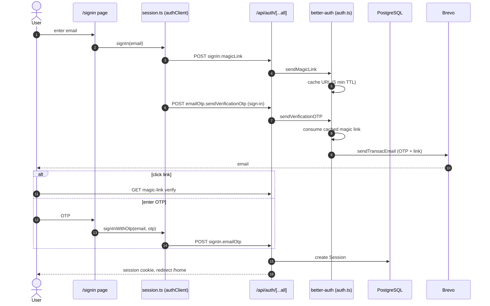
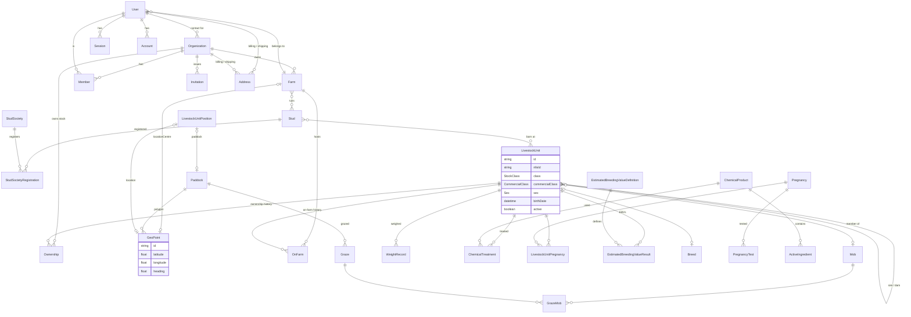
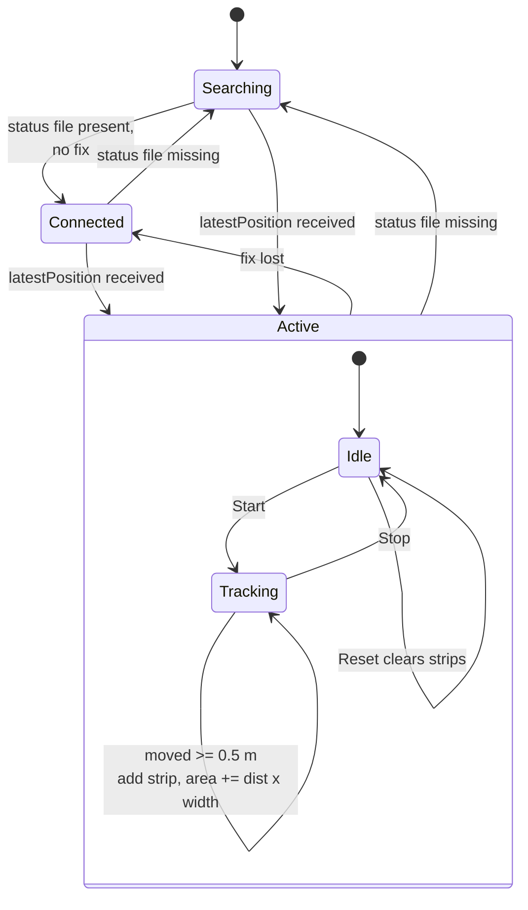

# AgNerd Architecture

AgNerd is a Next.js 16 (App Router) farm-management application backed by PostgreSQL via Prisma 7. It manages farms, livestock and pasture, and provides an RTK-capable GNSS guidance screen fed by a companion GNSS reader service and NTRIP correction forwarder.

## 1. System context

## 2. Deployment

Installed by [install.sh](../install.sh). The app, GNSS reader, and NTRIP forwarder run under systemd and log to the journal.

## 3. Application structure

## 4. GNSS position flow

`gnss-reader.mjs` reads from gpsd (default) or directly from the serial port (NMEA RMC + UBX NAV-PVT). Every `GNSS_POST_INTERVAL_MS` (default 1 s) it writes a status file and posts the latest fix to the app.

## 5. NTRIP correction flow

## 6. Authentication flow

Passwordless sign-in via better-auth with the `magicLink` and `emailOTP` plugins. The magic link is cached in memory for 5 minutes and delivered in the same email as the OTP.

## 7. Data model (core entities)

Source: [prisma/schema.prisma](../prisma/schema.prisma). The client is generated to `app/generated/prisma`. `app/prisma/schema.prisma` is a legacy schema and is not used by `prisma.config.ts`.

Standalone tables: `Verification` (better-auth), `LoraDevice` (future LoRaWAN tags).

## 8. Navigation screen

[Navigation.tsx](../app/components/screens/Navigation.tsx) hosts a Cesium viewer, opens framed on Australia, flies to the GPS fix (or the farm's `locationCentre`) and renders a tractor model with a heading-following chase camera. While tracking, it paints coverage strips of the configured implement width/offset and accumulates area.

## 9. Key scripts

| Script | Purpose |
| --- | --- |
| `npm run dev` / `build` / `start` | Next.js app |
| `npm run generate` (also `postinstall`) | `prisma generate` to `app/generated/prisma` |
| `npm run copy-cesium` | Copy Cesium static assets to `public/cesium` |
| `npm run gnss:reader` | Run [gnss-reader.mjs](../scripts/gnss-reader.mjs) |
| `npm run gnss:ntrip` | Run [ntrip-forwarder.mjs](../scripts/ntrip-forwarder.mjs) (closest CORS station) |
| `npm run gnss:ntrip:bash` | Compatibility alias for the JavaScript NTRIP forwarder |
